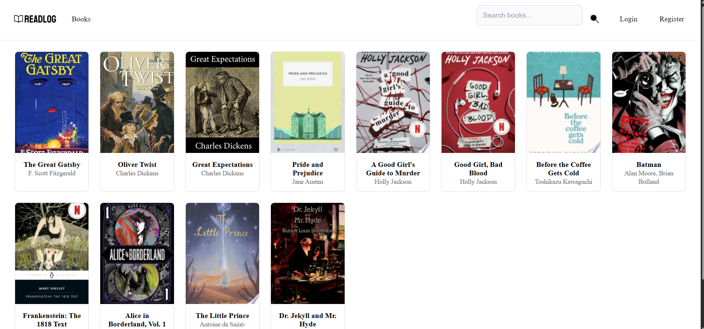

## About the Project

Readlog is a responsive web application engineered to simplify personal book logging and reading management. Developed as a university project, it features a clean interface for cataloging titles, tracking reading progress, and organizing personal libraries with ease.

### 🎯 Key Objectives
- Design an intuitive and clutter-free interface for book lovers.
- Implement robust CRUD (Create, Read, Update, Delete) operations for personal reading logs.
- Integrate an API (Google Books API)
